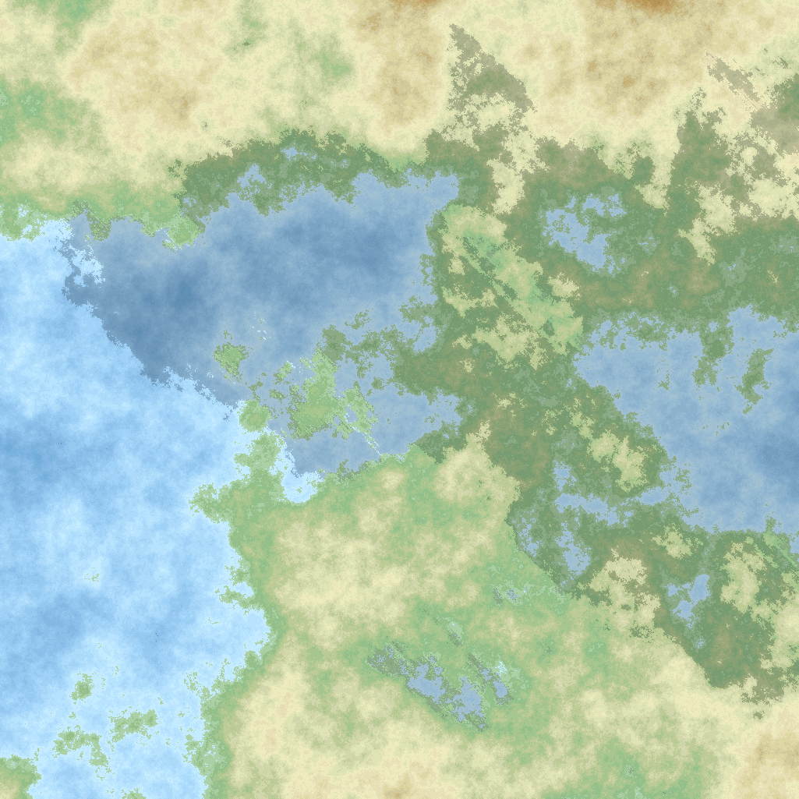

# Author

**Nome:** Caio Dantas  
**Curso:** Ciência da Computação   
**Projeto:** Geração Procedural de Terrenos com Diamond-Square  

## Descrição
Este projeto implementa a geração procedural de terrenos utilizando o algoritmo Diamond-Square em C++.  

O programa permite:
- geração de mapas de altitude;
- leitura e escrita de arquivos de matriz;
- aplicação de paletas de cores para representação visual;
- geração de imagens PPM;
- aplicação de sombreamento para simular iluminação solar na direção noroeste.

## Exemplo de mapa gerado

## Tecnologias utilizadas
- C++
- Programação Orientada a Objetos
- Manipulação de arquivos
- Geração de imagens PPM

## Autor
Desenvolvido por Caio Dantas.